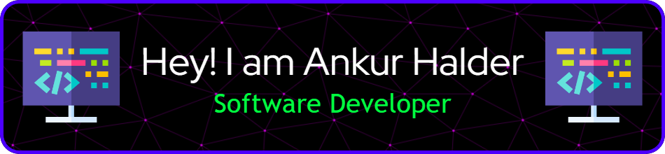
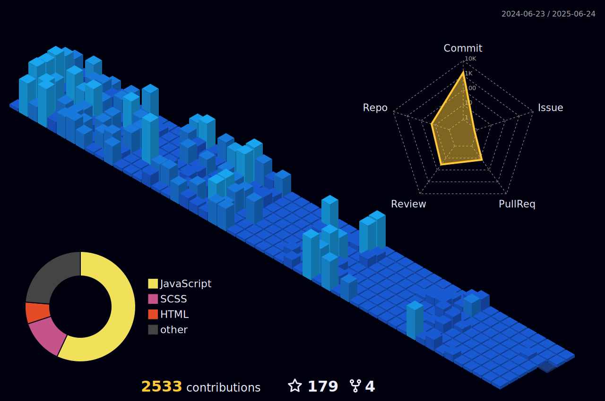

<h1 align="center">Hi 👋, I'm Ankur Halder</h1>
<h3 align="center">Passionate and enthusiastic about software development,  proficient in MERN stack, Django (full stack, REST API, ORM), Python (OOP), JavaScript (OOP), Next.js (full stack), and DSA. Confident and dedicated in creating effective solutions. Moreover, active contributor to open-source projects.</h3>

  

<!-- ## 🏆 GitHub Trophies

- 🔭 I’m currently working on [EDUVERSA](https://github.com/eduversa/eduversa.github.io) -->

- 🌱 I’m currently learning **Cloud Database management and Advanced DSA**

- 👨‍💻 All of my projects are available at [https://www.ankurhalder.in](https://www.ankurhalder.in)

- 💬 Ask me about **JavaScript, CSS, SCSS, react.js, next.js, Django, Flask, node.js, express.js, SQL, MYSQL, MongoDB, DevOps, Docker, Container, Google Cloud, AWS, Kubernetes**

- 📫 How to reach me **ankur.halder12345@gmail.com**

## Connect with me:

# 📊 GitHub Stats:

  
  
  
  
  

###

# 💻 Skills

  
  
  
  
  
  
  
  
  
  
  
  
  
  
  
  
  
  
  
  
  
  
  
  
  
  
  
  
  
  
  
  
  
  
  
  
  
  
  
  
  
  
  
  
  
  
  
  
  
  
  
  
  
  
  
  
  
  
  
  
  

###

<!-- # 💻 Tech Stack:

                            

# 📊 GitHub Stats:

  
   
  
   
  

 -->

## Commit Graph

## LeetCode Stats

  

## ✍️ Random Dev Quote

  

